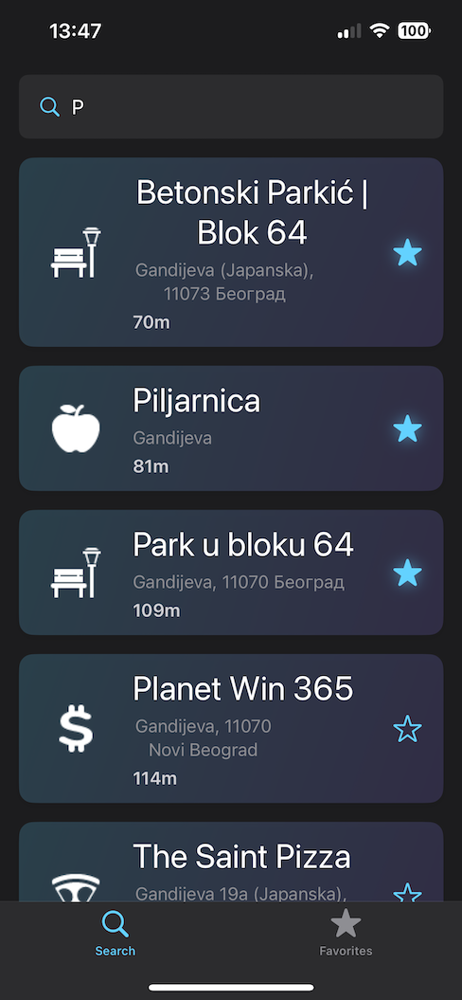
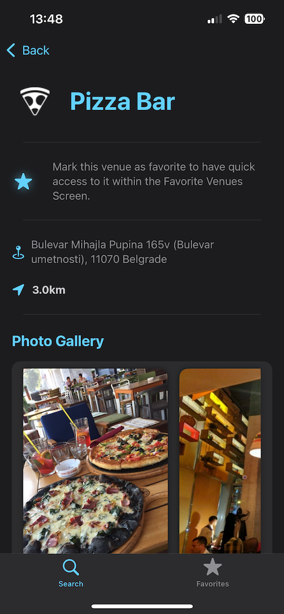
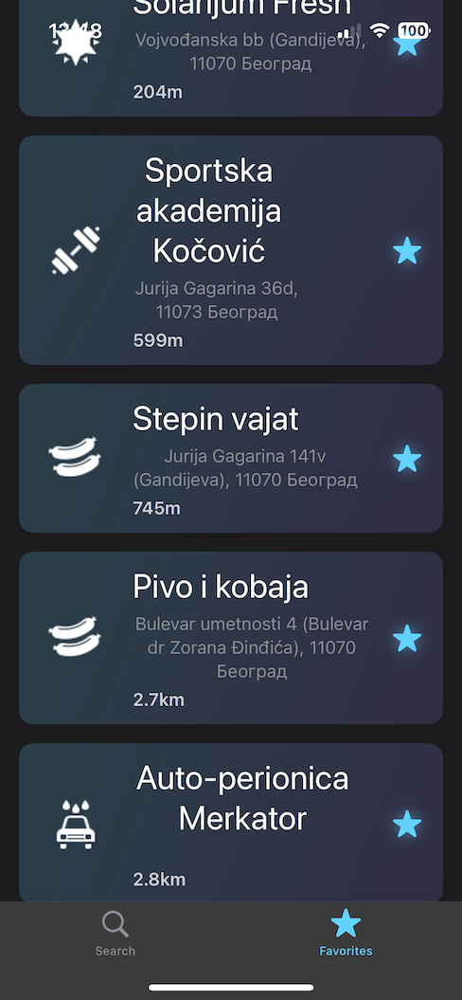

# ConVenuence

ConVenuence is a SwiftUI-based iOS application developed to enable users to discover venues, view detailed information, and save favorites using the Foursquare API. The app is designed with modularity, clean architecture, and testability to ensure scalability, maintainability, and robustness.

--- 


---

## Project Overview

### Key Features:
1. **Search for Venues:**
   - Search venues near the user's current location using a search string.
   - Display results in a clean, scrollable list.

2. **Venue Details:**
   - Display detailed information about a venue when selected from the search results.
   - Provide an option to save the venue as a favorite.

3. **Favorites Management:**
   - View all saved favorite venues in a dedicated screen.
   - Navigate to the venue details from the favorites list.

4. **Offline Support:**
   - Cache search results for offline access.
   - Compute distances locally for offline accuracy.

5. **Data Persistence:**
   - Save favorite venues and cached search results using UserDefaults.

6. **Functional UI:**
   - Utilize SwiftUI for all components.

---

## Technical Architecture

### 1. **Clean Architecture**
The project is structured into layers to ensure separation of concerns and maintainability:

#### **Networking Layer**
- Handles all API communication using `URLSession`.
- Includes DTOs for serialization and deserialization.
- Protocol-based abstraction (`VenueAPIClient`) for mocking and testability.

#### **Persistence Layer**
- Implements data caching and favorite management using UserDefaults.
- Encapsulated in `VenuePersistenceService` for modularity and extensibility.

#### **Service Layer**
- Encapsulates networking and persistence to provide a unified API via `VenueRepositoryService`.
- Includes caching mechanisms and offline handling.

#### **UI Layer**
- Built with SwiftUI and MVVM architecture.
- Includes:
  - **Search Screen**
  - **Venue Details Screen**
  - **Favorites Screen**

### 2. **Dependency Injection**
The `ServiceLocator` pattern is used to manage dependencies, ensuring loose coupling and easy testing. Note: The Foursquare API authorization key must be securely injected into the `ServiceLocator` for the project to work. Avoid hardcoding sensitive credentials in the codebase.

### 3. **Image Caching**
Utilized the Kingfisher library for efficient image caching.

### 4. **Manual Distance Computation**
Computed venue distances locally to ensure functionality in offline mode.

---

## Key Components

### **Core Logic**
- `CVCore`: A Swift Package containing all non-UI logic.
  - **Domain**: Defines core data structures and utilities.
  - **Networking**: Handles API requests and responses.
  - **Persistence**: Manages data caching and favorites.
  - **Services**: Provides high-level APIs for the app.

### **Search Venues**
- `SearchVenuesViewModel` debounces search input and fetches results from the repository.
- Displays results in `SearchVenuesView` using a SwiftUI-friendly design.

### **Venue Details**
- `VenueDetail` provides detailed venue information including photos.
- Favorites can be toggled directly from the detail view.

### **Favorites Management**
- Favorites are managed through `VenueRepositoryService` and displayed in a SwiftUI list.

### **Offline Mode**
- Caches search results and prefetches favorites for offline access.

---

## Installation

1. Clone the repository:
   ```bash
   git clone <repository-url>
   ```
2. Open the project in Xcode.
3. Ensure dependencies (e.g., Kingfisher) are installed using Swift Package Manager.
4. Build and run the app on a simulator or device.

---

## API Integration

### Authorization keys must be securely injected into the `ServiceLocator`. 
If you open up the code you'll see within the `ServiceLocator` where the authorization key should go, I didn't want to hardcodeded it in the codebase for security reasons. 
Within the file, insert the authorization key here:

```swift

    private func getAuthorizationHeader() -> String? {
        // TODO: Implement a secure way to store and retrieve the API key - DO NOT MERGE IN A HARD-CODED API KEY
        return nil // Return the real API key here when running the app
    }

```

---

## Screenshots

### Search Screen
Displays search results for venues near the user's location.
- Also allows saving to favorites
- Offline support with cached results





### Venue Details Screen
Shows detailed venue information and allows saving to favorites.




### Favorites Screen
Lists saved favorite venues with navigation to details.




---

## Project Structure (not the exact one)

```plaintext
ConVenuence/
├── CVCore/                # Swift Package for core logic
│   ├── Domain/            # Data models and domain utilities
│   ├── Networking/        # Networking logic
│   ├── Persistence/       # Data persistence layer
│   ├── Service/           # Repository services
│   └── Tests/             # Unit tests for all core logic
├── ConVenuence/           # Main app
│   ├── Views/             # SwiftUI views
│   ├── ViewModels/        # ViewModels for MVVM pattern
│   └── App.swift          # App entry point
└── README.md              # Project documentation
```

---

## Future Enhancements

1. **Pagination:**
   - Load venues in batches for large results.

2. **Core Data Persistence Support:**
   - Extend caching to include detailed venue information.

---

## Requirements Recap

### Functional Requirements
- Search venues by user location and query.
- View detailed venue information.
- Save and manage favorite venues.
- Display cached results offline.

### Technical Requirements
- Use SwiftUI and MVVM.
- Implement clean architecture.
- Ensure modular and reusable code.

---

## License
This project is licensed under the MIT License. See the `LICENSE` file for details.
